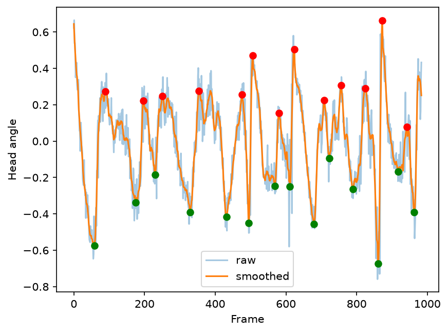

# automated-body-bends-assay

A tool that watches a video of a *C. elegans* and automatically counts how many times it bends per minute — instead of a person counting by eye.

## Why

In the Ailion Lab, body bends assays are normally done by watching a worm and counting bends manually. This is subjective: different scientists count differently depending on what they consider a "full bend," and the same person can count differently between trials. This makes results hard to compare across people or across days.

This project replaces manual counting with a consistent, code-based measurement, so results don't depend on who's watching.

## What it does

1. Opens a video of a worm.
2. Separates the worm from the background in each frame.
3. Identifies the worm's head and tracks it frame to frame, even through reversals.
4. Measures how the head swings side to side over time.
5. Counts full bends and reports a bends-per-minute value.

## Example output



This plot shows the extracted head-angle signal over time, with detected peaks (red) and troughs (green) marking individual bends. This example matched a manual by-eye count exactly (27 vs. 27).

## Setup

```bash
pip install opencv-python scipy
```

## Usage

1. Place your worm video in this folder.
2. Update the filename in `automated-body-bends-assay.py` to match your video.
3. Run:
   ```bash
   python automated-body-bends-assay.py
   ```
4. Output:
   ```
   Bends per minute: 24.3
   ```

## Status

Core pipeline works: detects the worm, tracks its head through reversals, handles worms entering/leaving the frame, and extracts a bend-rate signal.

Validated against 3 videos, comparing automated counts to manual by-eye counts:

| Video  | Automated count | Manual count |
|--------|------------------|--------------|
| Test 1 | 10               | 12           |
| Test 2 | 27               | 27           |
| Test 3 | 12               | 15           |

Test 3 shows reduced accuracy due to a stretch of fast, jagged worm movement, which breaks the assumption of smooth frame-to-frame motion that the head-tracking and smoothing logic rely on. This is a known limitation of the current approach, not a bug — tracking is most reliable for continuous, non-erratic locomotion.

Next: investigate whether a higher frame rate or more targeted smoothing improves accuracy during fast movement; test across different genotypes to see if bend-rate differences are detectable.

## Background

Built from undergraduate research in the Ailion Lab on *C. elegans* genotypes affecting dense-core vesicle biogenesis (*rab-2*) and neuropeptide processing (*egl-3*, *egl-21*) — genes that affect neuron signaling and may alter movement.
